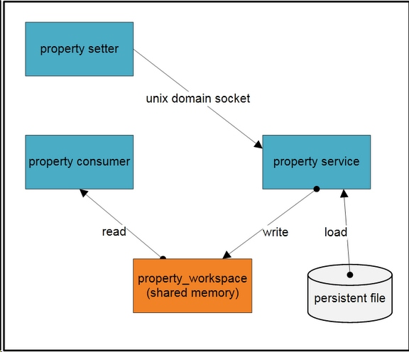
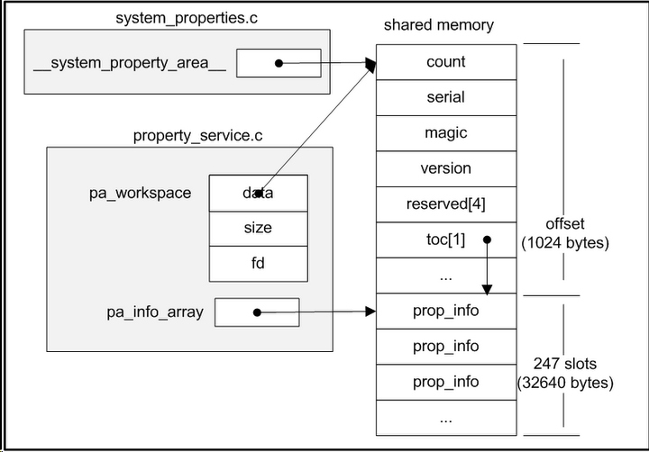

#概述

属性（property）系统对Android来说是一个重要的功能。他作为一个系统服务管理着系统的配置和状态，所有的这些系统配置和状态都是属性 （property）。属性（property）是一对键/值（key/value）组合，键和值都是字符串类型。
总体感觉属性系统非常像Windows的注册表的功能。Android中非常多的应用程序和库直接或者间接的依赖于属性系统，并由此决定其运行期的行为。例如：adbd进程通过属性来决定是否当 前运行在模拟器中。再比如：java.io.File.pathSeparator方法返回存储在属性服务中的值。
   

#属性系统怎样工作
属性系统宏观的结构图如下所示：

从图中我们可以看出Android属性系统由有三个进程，一组属性文件和一块共享内存组成。这块共享内存保存着系统中所有的属性记录，只有 Property service能写这块共享内存，并且Property service负责将属性文件中的属性记录加载到共享内存中。

属性读取进程（property consumer）把这块共享内存映射到自己的进程空间，然后直接读取它。属性设置进程（property setter）也加载这块共享到他的进程空间，但是他不能直接写这块共享内存。当他需要增加或者修改属性的时候，通过Unix Socket发生属性给Property service，Property service将代表设置进程写入共享内存和属性文件。

Property service运行于init进程中。init进程首先创建一块共享内存，并把他的句柄fd存放在这块内存中，init进程通过mmap带 MAP_SHARE标志的系统调用，把这块内存映射到他的虚拟空间中，最终这块内存所有的更新将会被所有映射这块共享内存的进程看到。共享内存句柄fd和 共享内存大小存储在系统环境变量“ANDROID_PROPERTY_WORKSPACE”中，所有的进程包括属性设置进程和属性读取进程都将通过这个系 统环境变量获得共享内存的句柄fd和大小，然后把这块内存映射到他们自己的虚拟空间。共享内存布局如下：

然后，init进程将会从以下文件中加载属性：
>
1   /default.prop
2   /system/build.prop
3   /system/default.prop
4   /data/local.prop

下一步是启动Property service。这步中，将会创建一个Unix Socket服务器，这个Socket有一个闻名的名称“/dev/socket/property_service”。最后init进入死循环，等待socket的连接请求。

在读取进程中，当它初始化libc库的时候，将会获得属性系统共享内存的句柄和大小（bionic/libc/bionic /libc_init_common.c __libc_init_common函数）。并把这块共享内存映射到自己的进程虚拟空间中(bionic/libc/bionic /system_properties.c __system_properties_init函数)。这样读取进程将会向访问普通内存一样访问属性系统的共享内存了。

当前，属性不能被删除。也就是说一旦属性被创建，将不可以被删除，但是它们可以被修改。
   

#怎样获得和设置属性

在Android中有三种方式来设置和获取属性：

-    native code
当编写Native的程序时，可以使用property_get和property_set API来获得和设置属性。使用这两个API必须要包含头文件cutils/properties.h和链接libcutil库。
 

-   java code
Android在Java库中提供System.getProperty和System.setProperty方法，我们Java程序可以通过他们来设置和获得属性。
但是请注意！虽然从语法上面看Java的代码和Native代码非常相近，但是Java版本存储把属性存在其他地方，而不是我们上面提到的属性系统中。在 JVM中有一个hash表来维护Java的属性。所以Java属性和Android属性是不同的，不能用Java API（System.getProperty和System.setProperty）来设置系统属性。也不能通过Native的方法 （property_get和property_set）设置Java的属性。
更新：Andrew指出android.os.SystemProperties可以操作Android系统属性（虽然这个类倾向于内部使用）。这个类通过JNI调用Native的property_get和property_set方法来获得和设置属性。
 

-   shell script Shell脚本
getprop [keyname] Keyname为需要获取的键值名，如果没有参数则打印全部的键值信息。
setprop [keyname] [value] Keyname为需要获取的键值名，value为设置的值，这个值为字符串。
watchprops 监听系统属性的变化，如果期间系统的属性发生变化则把变化的值显示出来。
   

#Android 系统的配置信息
